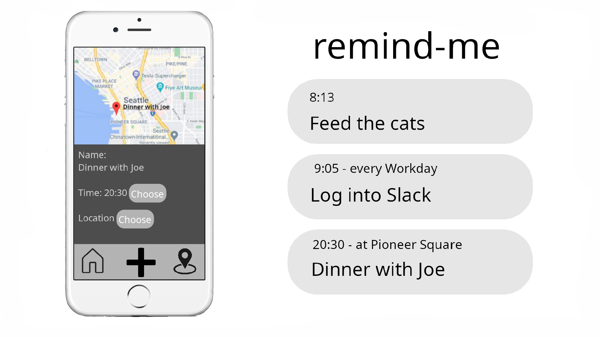

# remind-me

An app for creating reminders that are triggered at specific times or at specific locations.

Target audience: People who have difficulty remembering things.

Unique Value Proposition: Reminders with integration into the system’s clock app.

Pricing strategy: Free software (free as in freedom and free as in gratis).

Distribution: GitHub

Two promotional measures:

- Website with SEO optimization

- Word of mouth

Minimum required core functionalities:

- Set reminders for specific times.

- Set recurring reminders at an interval (hourly, daily, weekly, etc.).

- Trigger reminders at specific locations.

